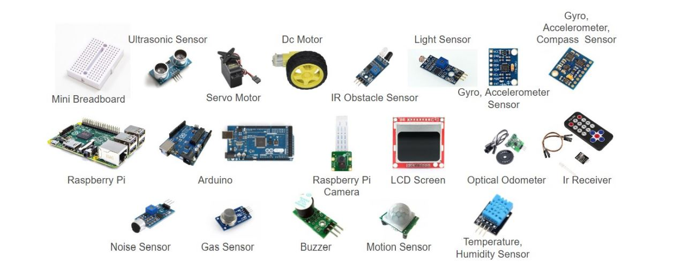
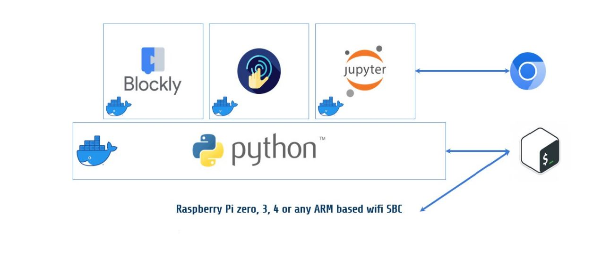

## Work in progress :warning:

Εκπαιδευτικό ρομπότ ανοιχτού λογισμικού και υλισμικού για όλες τις βαθμίδες της εκπαίδευσης, αναπτύσσεται συνεργατικά από το Χαροκόπειο Πανεπιστήμιο και την ΕΕΛΛΑΚ, είναι επέκταση του "GSOC 2019 - A DIY robot kit for educators" https://github.com/eellak/gsoc2019-diyrobot.  Η χρήση του FOSSBOT στην εκπαίδευση θα υποστηριχθεί από συνεργατικά σεμινάρια προς όλους τους εκπαιδευτικούς όλων των ειδικοτήτων και βαθμίδων με βάση εκπαιδευτικό υλικό που αναπτύσσεται στο https://elearn.ellak.gr.  Στόχος της δράσης είναι να εξοικειωθούν οι εκπαιδευτικοί με σύγχρονα μοντέλα εκπαίδευσης βασισμένα στην προσέγγιση S.T.E.A.M. (Science, Technology, Engineering, Arts, Mathematics) και στη μαθητοκεντρική προσέγγιση της γνώσης,  με βάση τις ανοιχτές τεχνολογίες, ώστε να μπουν οι βάσεις για τη δημιουργία ενός ανοικτού περιβάλλοντος ανακαλυπτικής μάθησης που θα συμβάλει δημιουργικά στην μετατροπή των μαθητών σε ενεργούς πολίτες.

Το FOSSBot ανήκει στην κατηγορία DIY (Do It Yourself), με την λογική ότι μπορεί εύκολα να κατασκευαστεί και από άλλα άτομα πέρα από τους δημιουργούς του ή ακόμα η διαδικασία αποσυναρμολόγησης και επανασυναρμολόγησης μπορεί να αποτελέσει κομμάτι εκπαιδευτικής διαδικασίας στα πλαίσια του σχολείου. Αυτό είναι εφικτό, καθώς το FOSSBot είναι κατασκευασμένο από ηλεκτρονικά υλικά που μπορούν να βρεθούν εύκολα στο εμπόριο με χαμηλό κόστος ενώ τα πλαστικά μέρη είναι εύκολα εκτυπώσιμα.

## Εξοπλισμός 
#### Sensors:
* Ultrasonic distance sensor
* Battery Sensor
* Accelerometer
* Gyroscope
* Odometers
* IR Receiver
* Line detection sensors
* Light Sensors

#### General Features:
* Lego compatible surface
* Hole in front for marker/ pencil attachment
* Special pulling loop
* Rechargeable batteries

#### Interaction Features:
* Speaker
* Front RGB LED

## UI 

## 3D εκτυπώσιμα μέρη 

Τα πλαστικά μέρη, πέρα από τις ρόδες, είναι εκτυπώσιμα σε τρισδιάστατο εκτυπωτή και ο συνολικός χρόνος εκτύπωσης δεν ξεπερνά τις 36 ώρες. Αξίζει να αναφέρουμε ότι το σώμα του ρομπότ έχει σχεδιαστεί με τέτοιο τρόπο ώστε να διευκολύνει την διαδικασία συναρμολόγησης του. Αυτό έχει επιτευχθεί αφού στο εσωτερικό του ρομπότ έχουν σχεδιαστεί θήκες, προσαρμοσμένες στα ηλεκτρονικά στοιχεία, ώστε αυτά να τοποθετούνται στις αντίστοιχες θέσεις και να μην μετακινούνται κατά την διάρκεια χρήσης του ρομπότ. Ακόμα, στην εξωτερική επιφάνεια υπάρχουν εκτυπωμένα σύμβολα που υποδεικνύουν την θέση του κάθε αισθητήρα. Τα σύμβολα βοηθούν και τους εκπαιδευτικούς για να γνωρίζουν την θέση των αισθητήρων π.χ. ηχείο, led κλπ. Ο κατακόρυφος σωλήνας που διατρέχει από πάνω προς τα κάτω το κύριο σώμα του ρομπότ επιτρέπει την προσάρτηση ενός μολυβιού ή ενός μαρκαδόρου, ώστε μετακινώντας το FOSSBot σε μια περιοχή καλυμμένη με χαρτί να μπορούν να δημιουργηθούν σχήματα.

Τα τυπωμένα πλέγματα στην μπροστινή και την επάνω πλευρά του ρομπότ βοηθούν να διατηρούνται δροσερά τα ηλεκτρικά μέρη. Η υποδοχή φόρτισης του ρομπότ, ο διακόπτης on/off και ο μοναδικός βρόχος για τη ρυμούλκηση μικρών αντικειμένων βρίσκονται όλα στο πίσω μέρος. Ο βρόχος χρησιμεύει επίσης για την προστασία του ρομπότ από μικρές συγκρούσεις. Πάνω από τους τροχούς βρίσκονται δύο τυπωμένα σπόιλερ τόσο για την προστασία των τροχών όσο και για την αισθητική σχεδίαση του ρομπότ. 

Η επάνω επιφάνεια του ρομπότ χωρίζεται σε δύο κομμάτια. Ένα κάλυμμα που στερεώνεται στο κύριο σώμα χρησιμοποιώντας μοναδικά κλιπ αποτελεί το αρχικό εξάρτημα. Το κύριο κάλυμμα μπορεί να ενωθεί με το πάνω κάλυμμα χρησιμοποιώντας μια εύκολη λειτουργία περιστροφικής κίνησης και κλειδώματος. Μπορεί εύκολα να αφαιρεθεί για να δώσει πρόσβαση στο εσωτερικό του ρομπότ και μπορεί επίσης να υποστηρίξει μια βάση από τούβλα Lego, επιτρέποντας την προσθήκη περισσότερων τούβλων στην κορυφή του ρομπότ. Αυτή η επιλογή δίνει τη δυνατότητα στους δασκάλους των χαμηλότερων τάξεων να συνδυάσουν FOSSBot με άλλα έργα Lego και μπορεί να βοηθήσει στην προσθήκη νέων δραστηριοτήτων στο FOSSBot.

## Οδηγίες εκτύπωσης και συναρμολόγησης 

Η αρχική έκδοση των οδηγιών εκτύπωσης και συναρμολόγησης, ΕΔΩ 

## Τρόποι λειτουργίας

Υπάρχουν τέσσερις βασικοί τρόποι χρήσης του FOSSBot. Η χρήση της διεπαφής του FOSSBot επιτρέπει στον χρήστη να επιλέξει έναν από τους πιθανούς τρόπους χρήσης:
*	της διεπαφής χρήσης του ρομπότ χωρίς τη χρήση κώδικα που είναι κατάλληλη για παιδιά προσχολικής ηλικίας και παρουσιάζει τις κύριες δυνατότητες του ρομπότ, για παράδειγμα μετακίνηση του ρομπότ προς τα μπροστά ή πίσω,
*	της διεπαφής γραφικού προγραμματισμού που βασίζεται σε μπλοκ που εστιάζει σε μαθητές πρωτοβάθμιας εκπαίδευσης
*	της διεπαφής συγγραφής κώδικα σε σημειωματάρια (notebooks) που μπορεί να χρησιμοποιηθεί για τη διδασκαλία μαθητών Λυκείου Μαθητές Πρωτοβάθμιας Εκπαίδευσης και διδάσκοντας στους μαθητές τις βασικές αρχές του προγραμματισμού Python (όπως βρόχους, συνθήκες, συμβάντα κ.λπ.).
*	της διεπαφής συγγραφής κώδικα σε Python απευθείας στο κέλυφος προγραμματισμού του FOSSBot, ελέγχοντας απευθείας τα ηλεκτρονικά στοιχεία σε χαμηλό επίπεδο.

## Λίγα λόγια για το λογισμικό του FOSSBot

Το FOSSBot βασίζεται σε μια αρθρωτή στοίβα λογισμικού που του επιτρέπει να υλοποιεί τα διάφορες λειτουργίες προγραμματισμού, να ενορχηστρώνει τα πάντα μέσω του GUI και να ελέγχει το υλικό με εύκολο τρόπο μέσω μιας βιβλιοθήκης λογισμικού που παίζει το ρόλο του λειτουργικού συστήματος FOSSBot. Η στοίβα αυτή περιλαμβάνει το Google Blockly, το Python Jupyter, το Python Flask που φιλοξενεί το GUI του FOSSBot, την βασική βιβλιοθήκη FOSSBot γραμμένη σε Python που ελέγχει το υλικό του ρομπότ και τέλος την χειροκίνητη λειτουργία που προσφέρει στους χρήστες μέσω μιας διεπαφής χρήστη, δηλαδή έναν τρόπο ελέγχου του ρομπότ χωρίς καμία γνώση προγραμματισμού. 
Το λογισμικό του FOSSBot έχει δημιουργηθεί χρησιμοποιώντας τις πιο πρόσφατες εκδόσεις των παραπάνω τεχνολογιών, συμπεριλαμβάνοντας και του Docker, της συνεχούς ενοποίησης και της λογικής ενοποίησης μικροϋπηρεσιών (CI). Όπως αναφέρθηκε και στην εισαγωγή, ο προγραμματισμός του ρομπότ μπορεί να γίνει με διαφορετικούς τρόπους που ακολουθούν και αναλύονται. 

## Συνεχής ανάπτυξη λογισμικού και ενημερώσεις

Το FOSSBot αποτελείται από ένα σύστημα μοντέρνας αρχιτεκτονικής, με κάθε κομμάτι του λογισμικού να βρίσκεται σε ξεχωριστό docker image, που επιτρέπει τη διαρκή ολοκλήρωση μέσω αναβαθμίσεων του λογισμικού του. Η προσέγγιση της διαρκούς ολοκλήρωσης (Continuous Integration - CI) επιτυγχάνεται μέσω του Github, το οποίο πέρα από ότι είναι ένα αποθετήριο κώδικα, διαθέτει και εργαλεία για την σωστή οργάνωση και συνεργασία των μελών της ομάδας αλλά και την συνεχή αναβάθμιση και ενημέρωση των αρχείων του λογισμικού του ρομπότ. Πέρα από το Github, χρησιμοποιείται και το Docker Hub, στο οποίο προωθούνται οι αλλαγές που γίνονται κάθε φορά στον κώδικα στο Github, ώστε να υπάρχει διαθέσιμη η εικόνα της τελευταίας.

## Συμπεράσματα και επόμενα βήματα

Από την πρώτη στιγμή, το FOSSBot έχει ήδη βρει υποστήριξη από ομάδες ανοιχτού λογισμικού, όπως η ΕΕΛΛΑΚ και το Ίδρυμα Ωνάση που χρηματοδότησε τη συναρμολόγηση των πρώτων 100 FOSSBot, του προγράμματος Google Summer of Code που χρηματοδότησε τους πρώτους γύρους ανάπτυξης, και φυσικά τους φοιτητές και καθηγητές από ελληνικά πανεπιστήμια που αγκάλιασαν την όλη προσπάθεια. Ωστόσο, υπάρχει ακόμη χώρος για βελτίωση, προκειμένου να γίνει το FOSSBot ανταγωνιστικό σε σχέση με τις υπάρχοντες εμπορικές λύσεις. Ο κύριος στόχος μας είναι να λυθούν τυχόν ζητήματα που σχετίζονται με το λογισμικό του FOSSBot καθώς και να γίνει απλοποίηση της διαδικασίας της συναρμολόγησής του, με τον σχεδιασμό ειδικής πλακέτας για την ενσωμάτωση των περισσότερων καλωδιώσεων. 

## Ομάδα Ανάπτυξης Υλικού/Λογισμικού
* Ηρακλής Βαρλάμης
* Χρήστος Χρόνης
* Θανάσης Αποστολίδης
* Ελευθερία Παπαγεωργίου

